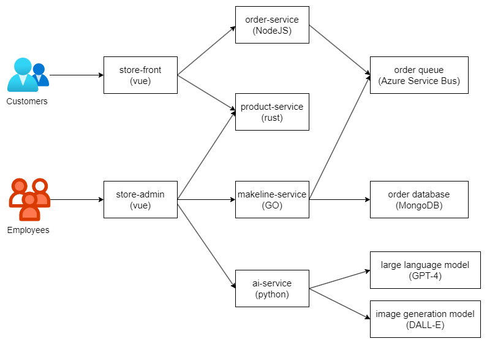

# CST 8915 - Assignment 2
The Best Buy Application is a cloud-native, microservices-based solution for managing product data, order, and customer interactions. It integrates AI-powered product descriptions and image generation using GPT-4 and DALL-E to enhance user experience. The application leverages Azure Service Bus as a backing service for order queuing and is deployed on a Kubernetes Cluster, ensuring scalability, reliability, and modularity.

## Updated Application Architecture

## Application and Architecture Explanation
### Application Functionality
1. **Store-Front**: A customer-facing web application for browsing products, viewing AI-generated product images and descriptions, and placing orders.
2. **Store-Admin**: An employee-facing backend web application for managing products and monitoring order status.
3. **Order-Service**: Processes order creation and publishes them to a managed message queue service via Azure Service Bus.
4. **Product-Service**: Handle CRUD operations for product data and interacts with the AI-Service to generate product descriptions and images.
5. **Makeline-Service**: Consumes messages from the order queue to process and complete orders.
6. **AI-Service**: Leverages GPT-4 and DALL-E to generate product descriptions and images dynamically.
7. **MongoDB**: A Non-SQL database that persists product and order information.

### Architecture Workflow
1. A customer visits the **Store-Front** to browse products.
2. The **Product-Service** provides product details, enriched with descriptions and images generated by the AI-Service.
3. The customer places an order, which is processed by the **Order-Service** and queued in **Azure Service Bus**.
4. The **Makeline-Service** consumes the order from the queue, processes it, and updates its status in the **MongoDB database**.
5. Employees monitor and manage orders via the **Store-Admin** application.

